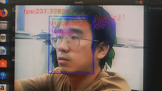

<div align="center">
  <a href="http://www.zeusee.com">
    
  </a>  

  <h1>HyperFT</h1>
</div>

## 简介

开源视频人脸跟踪算法,基于mtcnn人脸加测+onet人脸跟踪，移动端速度可以达到150fps+。该项目基于Android工程，提供底层JNI实现，使用者可以自行编译移植到其他平台。算法依赖ncnn深度学习计算库，体积小，易于集成。

<p>
<div align="center">

<div align="center">Demo(运行于 Ubuntu 18.04, i5-7400, NCNN)</div>
</div>
<p>

如果你想要了解更多，请参考：

* [官方主页](http://www.zeusee.com)
* [Github](https://github.com/zeusees/HyperFT)
* [Gitee](https://gitee.com/huiwei13/HyperFT)

## 代码编译

### 环境准备

* Android Studio v3.5

* CMake:3.6.4

* Android SDK Platform-Tools：29.0.3

* Android SDK Tools：26.1.1

* NDK：r15c

### 依赖库

* OpenCV：3.4.7 [OpenCV](https://sourceforge.net/projects/opencvlibrary/files/4.1.1/opencv-4.1.1-android-sdk.zip/download)

* ncnn：20190611 bade132 [ncnn](https://github.com/Tencent/ncnn/releases/download/20190611/ncnn-android-lib.zip)

### 编译设置

1.设置Android NDK与Android SDK地址

2.修改CMake编译文件，在app/src/main/cpp/下修改CMakeLists.txt文件:

``` bash
include_directories (D:/Wendell/Develop/libs/ncnn-android-lib/include)
include_directories(D:/Wendell/Develop/libs/OpenCV-android-sdk/sdk/native/jni/include)
set(OpenCV_DIR "D:/Wendell/Develop/libs/OpenCV-android-sdk/sdk/native/jni")
set_target_properties(libncnn PROPERTIES IMPORTED_LOCATION D:/Wendell/Develop/libs/ncnn-android-lib/${ANDROID_ABI}/libncnn.a)
```

## 相关资源


* [MTCNN的另类用法](https://blog.csdn.net/relocy/article/details/84075570)

* [Win版HyperFT](https://github.com/qaz734913414/Ncnn_FaceTrack)

* [Linux版HyperFT](https://github.com/xiangdeyizhang/FaceTrack_ncnn_HyperFT)

## 体验

* [体验apk](https://fir.im/HyperFT)

## TODO

+ Sorry,目前还是需要依赖opencv，稍后提交精简版

+ iOS Project Develop

## 联系方式

* 主页：[智云视图](http://www.zeusee.com/)
* 源码：[Github](https://github.com/zeusees/HyperFT), [Gitee](https://gitee.com/huiwei13/HyperFT)
* QQ群：724142079, 746123554
